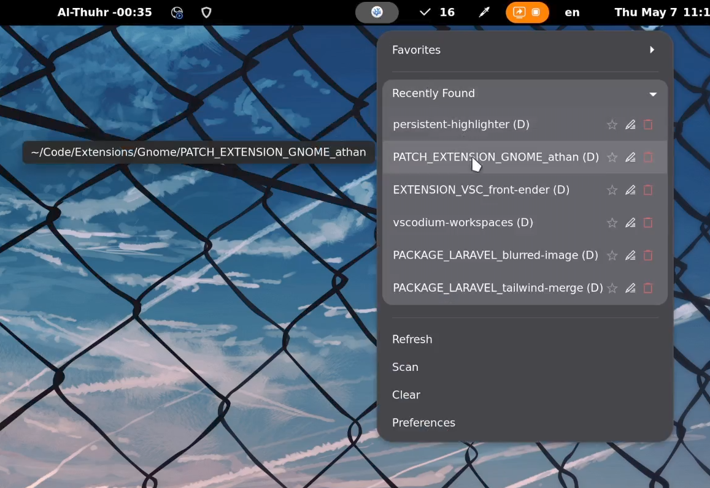

<div align="center">بسم الله الرحمن الرحيم</div>

<div align="left">

# VSCodium Workspaces

A quick VSC project traversal and workspace management tool for Linux, a GNOME Shell extension.

Forked for maintenance from the original project by [ZanzyTHEbar](https://github.com/ZanzyTHEbar), then rebranded for [VSCodium](https://vscodium.com)-first usage.




## Objectives

- Targeting GNOME Shell `v50` initially...
- Rewritten GNOME extension internals for a cleaner code path.
- Removed some extra preferences while renaming others for clarity.
- Renamed context menu options for brevity.
- Added a new option to do the initial scanning and looking for `.code-workspace` files.
- Fixes the stuck-hover-tooltip bug (tooltip now force-cleans on click, menu close, and disable).
- Having no duplicated entries.
- Added classification for VSC-opened directories and workspaces.
- The ability to rename entries too.
- Keeping the dropdown togglable lists open during interactions.
- Anchoring the label (project directory) to the left.
- An option to remember deleted workspaces. (disabled by default though)


## Installation

You can download the GNOME Shell extension from their platform:

<a href="https://extensions.gnome.org/extension/9877/vscodium-workspaces/" target="_blank">
    
</a>


## Debugging

Installing from source:

```bash
git clone https://github.com/GoodM4ven/PATCH_EXTENSION_GNOME_vscodium-workspaces.git
cd PATCH_EXTENSION_GNOME_vscodium-workspaces
make install
gnome-extensions enable vscodium-workspaces@goodm4ven
```

Requirements include:

- `node` + `npm`
- `python3` (required for Shexli helper tooling via local virtualenv)
- `zip` (only required for `make pack`)

For finding major GNOME errors:

```bash
journalctl /usr/bin/gnome-shell -f | grep vscodium-workspaces
```

You can also utilize Shexli analyzer for EGO reviews and for early detection:

```bash
npm run analyze:shexli
```

This command creates a local virtualenv at `.tools/shexli-venv` and installs pinned `shexli`.

### Removal

```bash
gnome-extensions disable vscodium-workspaces@goodm4ven
gnome-extensions uninstall vscodium-workspaces@goodm4ven
```

Or remove files directly:

```bash
rm -rf ~/.local/share/gnome-shell/extensions/vscodium-workspaces@goodm4ven
```


## Optional Nautilus Integration

This repo still ships the optional Nautilus scripts:

- `scripts/vscodium_nautilus_workspaces.py`
- `scripts/vscodium-nautilus-open.py`

Install Nautilus Python bindings (package name varies by distro), then copy scripts to Nautilus extensions:

```bash
mkdir -p ~/.local/share/nautilus-python/extensions
cp scripts/vscodium_nautilus_workspaces.py ~/.local/share/nautilus-python/extensions/
cp scripts/vscodium-nautilus-open.py ~/.local/share/nautilus-python/extensions/
chmod +x ~/.local/share/nautilus-python/extensions/vscodium_nautilus_workspaces.py
chmod +x ~/.local/share/nautilus-python/extensions/vscodium-nautilus-open.py
nautilus -q
```


## Support

Support ongoing maintenance as well as the development of **other projects** through [sponsorship](https://github.com/sponsors/GoodM4ven) or one-time [donations](https://github.com/sponsors/GoodM4ven?frequency=one-time&sponsor=GoodM4ven) if you prefer.


## Credits

- [ZanzyTHEbar](https://github.com/ZanzyTHEbar) (the original developer)
- [OpenAI - Codex](https://developers.openai.com/codex/cli)
- [gnome-shell-extension-appindicator](https://github.com/ubuntu/gnome-shell-extension-appindicator/blob/master/README.md) (for the get-on-gnome image)

</div>
<div align="center">والحمد لله رب العالمين</div>
